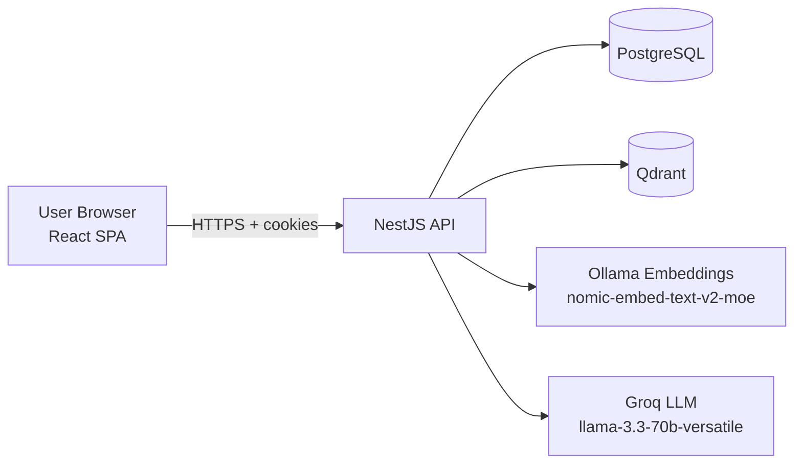

# AskDoc

AskDoc is a full-stack Retrieval-Augmented Generation (RAG) application for asking questions about your PDF documents.

Users sign in with Google, create workspaces, upload PDFs, and chat with an AI assistant that answers using retrieved document chunks and returns source citations.

## What It Does

- Authenticates users with Google OAuth 2.0
- Organizes documents into per-user workspaces
- Ingests PDF files asynchronously (extract, chunk, embed, index)
- Performs semantic retrieval from Qdrant vector search
- Generates grounded answers with Groq-hosted LLMs
- Persists conversation history and cited sources

## Tech Stack

### Backend
- NestJS 11, TypeORM, PostgreSQL
- Passport (Google OAuth), JWT cookies (access + refresh rotation)
- Qdrant (`@qdrant/js-client-rest`) for vector search
- LangChain text splitters + Ollama embeddings
- AI SDK (`@ai-sdk/groq`, `ai-sdk-ollama`)

### Frontend
- React 19 + Vite 7
- TanStack Router + TanStack Query
- Tailwind CSS 4 + Radix UI primitives
- Typed API client generated from OpenAPI (`@hey-api/openapi-ts`)

### Infrastructure
- Docker Compose for local PostgreSQL and Qdrant
- pnpm workspace monorepo (`backend`, `frontend`)

## Repository Structure

```text
askdoc/
  backend/      # NestJS API (auth, workspaces, files, chat)
  frontend/     # React SPA
  docker-compose.yml
  pnpm-workspace.yaml
```

## System Architecture



## Data Flow (High Level)

1. **Upload PDF** -> API stores file metadata -> async processing starts.
2. PDF text is extracted and split into chunks.
3. Chunks are embedded and indexed in Qdrant with workspace/file metadata.
4. **Ask question** -> question is optionally rewritten to standalone form.
5. Query embedding is searched against workspace-scoped vectors.
6. Top chunks are passed to the LLM to generate an answer.
7. Answer + sources are saved to conversation history and returned to UI.

## Local Development

### Prerequisites
- Node.js 20+
- pnpm 10+
- Docker + Docker Compose
- Ollama running locally with embedding model pulled:

```bash
ollama pull nomic-embed-text-v2-moe
```

### 1) Start infrastructure

```bash
docker compose up -d
```

### 2) Install dependencies

```bash
pnpm install
```

### 3) Configure environment

Create env files:

- `backend/.env`
- `frontend/.env`

Use values similar to:

```env
# backend/.env
PORT=3000
FRONTEND_URL=http://localhost:5173

DB_HOST=localhost
DB_PORT=5432
DB_USER=user
DB_PASS=password
DB_NAME=askdoc

QDRANT_URL=http://localhost:6333

JWT_SECRET=<your-jwt-secret>
JWT_EXPIRES_IN=15m
REFRESH_JWT_SECRET=<your-refresh-jwt-secret>
REFRESH_JWT_EXPIRES_IN=7d

GOOGLE_CLIENT_ID=<your-google-client-id>
GOOGLE_CLIENT_SECRET=<your-google-client-secret>
GOOGLE_CALLBACK_URL=http://localhost:3000/auth/google/callback

GROQ_API_KEY=<your-groq-api-key>
```

```env
# frontend/.env
VITE_backend_url=http://localhost:3000
```

### 4) Run the app

```bash
pnpm dev
```

- Backend: `http://localhost:3000`
- Swagger: `http://localhost:3000/api`
- Frontend: `http://localhost:5173`

## Scripts

### Root
- `pnpm dev` - run backend + frontend concurrently
- `pnpm build` - build all packages

### Backend
- `pnpm --filter ./backend start:dev`
- `pnpm --filter ./backend test`
- `pnpm --filter ./backend lint`

### Frontend
- `pnpm --filter ./frontend dev`
- `pnpm --filter ./frontend build`
- `pnpm --filter ./frontend lint`
- `pnpm --filter ./frontend openapi-ts`

## API Surface (Core)

- `GET /auth/google`, `GET /auth/google/callback`, `GET /auth/me`
- `POST /auth/refresh`, `POST /auth/logout`
- `CRUD /workspaces`
- `CRUD /workspaces/:workspaceId/files`
- `POST /workspaces/:workspaceId/chat/query`
- `CRUD /workspaces/:workspaceId/chat/conversations`

See full API docs in Swagger at `/api`.

## Important Notes

- TypeORM currently uses `synchronize: true` (development convenience).
- Move to migrations before production use.
- Do not commit real `.env` secrets.

## Roadmap Ideas

- Replace polling with SSE/WebSocket updates for file processing status
- Add background job queue (BullMQ) for resilient ingestion retries
- Add workspace sharing / role-based access
- Add test coverage for RAG pipeline and auth/session flows
